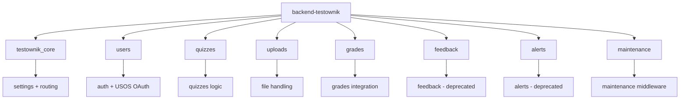
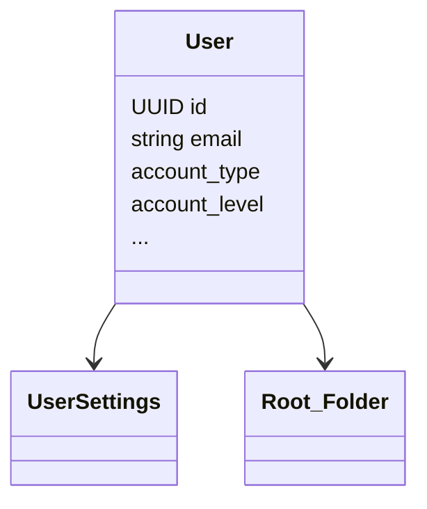
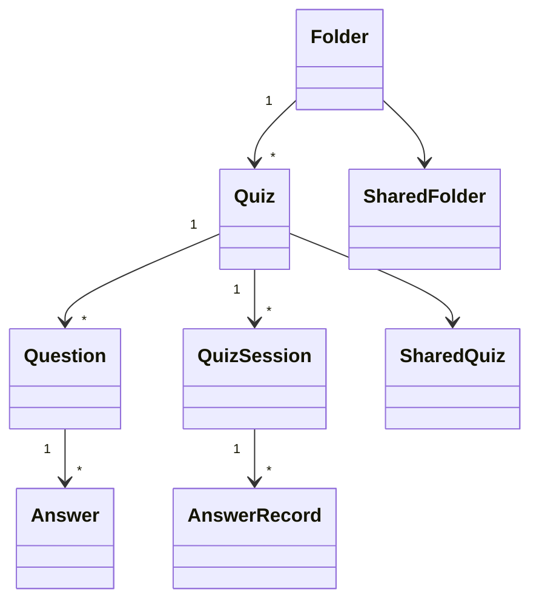
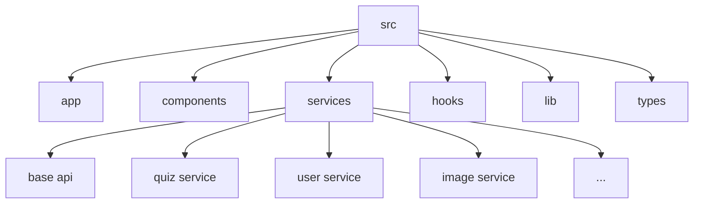
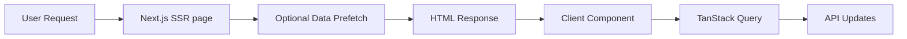
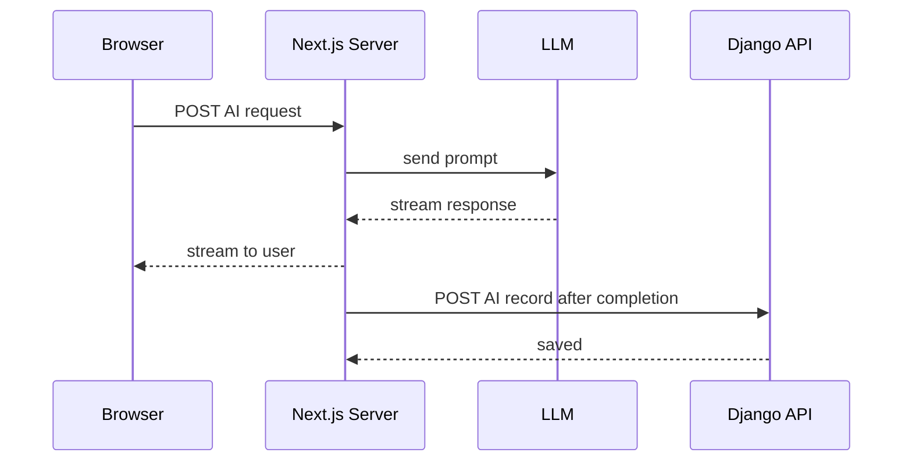

# Architecture – Testownik

**Project:** Testownik | **Semester:** Summer 2026  
**Author:** Antoni Czaplicki

---

## 1. Context

Testownik is a quiz-based learning and knowledge verification platform created for WUST students.  
The project consists of three repositories:

| Repository                 | Technology                                 | Role                              |
|----------------------------|--------------------------------------------|-----------------------------------|
| `Solvro/web-testownik`     | TypeScript, Next.js, React, TanStack Query | Web application (SPA/SSR)         |
| `Solvro/backend-testownik` | Python, Django 6, DRF, PostgreSQL          | REST API, business logic          |
| `Solvro/pm-testownik`      | Markdown                                   | Project management, documentation |

The application is available at <https://testownik.solvro.pl/>.

---

## 2. Backend Architecture (`backend-testownik`)

### 2.1 Django Application Structure



```
eedback/ - will be deprecated in favor of https://github.com/Solvro/backend-solvro-feedback
alerts/ - will be deprecated in favor of https://github.com/Solvro/backend-solvro-alerts
```

### 2.2 Key Data Models

#### Users (`users`)



#### Quizzes and Questions (`quizzes`)



- **Quiz**: `id`, `title`, `visibility` (0–3), `allow_anonymous`, `folder (FK)`
- **Question**: `question_type` (CLOSED=0, OPEN=1, TRUE_FALSE=2), `is_flashcard`, `is_markdown_enabled`
- **QuizSession**: current session state – `current_question`, `study_time`, `is_active`
- **AnswerRecord**: answer history – `selected_answers (JSON)`, `was_correct`

### 2.3 Authentication

- Authenticated users: JWT access token in normal cookie and refresh token in HttpOnly (
  `djangorestframework-simplejwt` + `users/auth_cookies.py`).
- Guests: server session backed by anonymous `User` record (`AccountType.GUEST`); identified by a JWT
  cookie.
- USOS OAuth: `Authlib` + `usos-api`.

---

## 3. Frontend Architecture (`web-testownik`)

### 3.1 Source Structure



### 3.2 Page Pattern: SSR + Client



### 3.3 Backend Communication

- Requests to `/api/*` are sent directly to Django.
- Authentication via JWT token stored in cookie.
- Server state managed by **TanStack Query** (cache, refetch, optimistic updates).

---

---

## 4. AI Integration Overview



### 4.1 Contextual Assistant

- **Input:** `question`, optionally `context` (answers selected by the user so far).
- **Processing (NEXT.js server side):** fuse question and context → build prompt → call LLM API → sanitise response (
  `nh3`).
- **Output:** hint text (does not contain the correct answer directly).

### 4.2 Question Generator from Notes

- **Input:** file (PDF, TXT, MD) or plain text.
- **Processing (NEXT.js server side):** parse file → extract text → build prompt → call LLM API → parse question
  structure.
- **Output:** list of `{ text, answers: [{text, is_correct}] }` objects for user review before saving.

### 4.3 AI Security

- LLM responses sanitised by `nh3` before being returned to the client.
- Prompt injection mitigated by separating user-supplied context from system instructions.
- Rate limiting: add throttling to prevent abuse and control costs.
